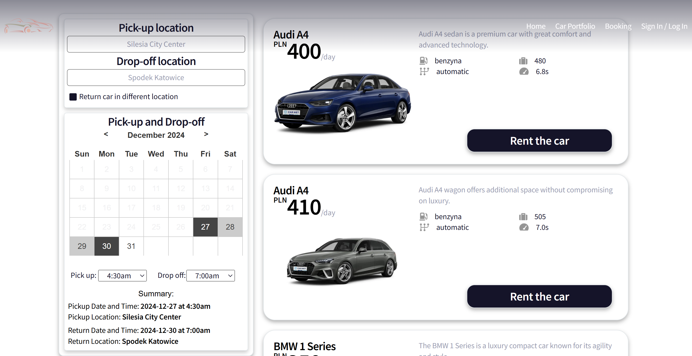
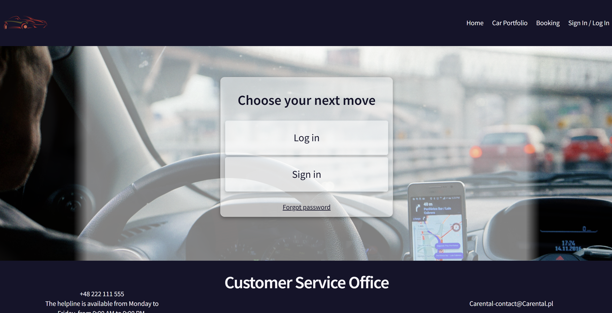

# Carental - Car Rental Website

Welcome to Carental, your one-stop solution for renting cars! This README provides an overview of the Carental website, its features, and instructions for using the site.

## Prerequisites

To set up and run the Carental website, you will need the following applications:

- **XAMPP**: A free and open-source cross-platform web server solution stack package, which includes Apache, MySQL, and PHP. You can download it from [https://www.apachefriends.org/index.html](https://www.apachefriends.org/index.html).
- **Web Browser**: Any modern web browser such as Google Chrome, Firefox, Edge, or Safari.
- **Text Editor/IDE**: An editor like Visual Studio Code, Sublime Text, or any other code editor of your choice.

### Setup Instructions

1. **Install XAMPP**:
   - Download and install XAMPP from the official website.
   - Once installed, start the Apache and MySQL services from the XAMPP Control Panel.

2. **Set Up the Database**:
   - Open PHPMyAdmin by navigating to `http://localhost/phpmyadmin` in your web browser.
   - Import the database schema and seed data by using the provided file `SQL setup - wypozyczalnia.sql`. This file will create the necessary database tables and populate them with initial data.

3. **Configure the Project**:
   - Create a folder named `Carental` in the `htdocs` directory of your XAMPP installation (usually found in `C:\xampp\htdocs` on Windows or `/Applications/XAMPP/htdocs` on macOS).
   - Copy all your project files (PHP, JS, CSS) into the `Carental` folder.

4. **Run the Project**:
   - Make sure to check if the Apache server and MySQL is running from the XAMPP Control Panel.
   - Open your web browser and navigate to `http://localhost/Carental`.
   - The website should now be up and running with the functionality described in the features section.

By following these steps, you'll have the Carental website set up and running locally on your machine.

## Features

### Home Page


- Four tiles that navigate the user to the Car Portfolio page with corresponding URL filters
- General information about the company
- Map providing information about abroad restrictions

### Car Portfolio


- Displays the company's car portfolio (from XAMPP database)
- Filters for the fleet:
  - City
  - SUV
  - Sports
  - Van
  - Electric
  - Luxury
  - Truck
- Tiles with selected car types appear after filtering
- Button "Rent the car" navigates the user to the Booking page with the car's name in the text filter

### Booking


- Advanced filtering options:
  - Text filtering
  - Vehicle type:
    - Show all
    - Passenger
    - Van
    - Delivery van
    - Electric
  - Transmission:
    - Manual
    - Automatic
  - Fuel type:
    - Gasoline/Petrol
    - Diesel
- Tiles with cars that match the selected categories appear after searching
- Segment mandatory to fill by a user:
  - Pick-up and Drop-off location
  - Pick-up and Drop-off date
  - Pick-up and Drop-off hour
- User selections are saved in localStorage and displayed in the "summary"
- Button "Rent the car" navigates the user to the Paying form page with the selected car and filled information

### Paying Form

- Summary of the selected car and user details
- User selects a "Waiver Package":
  - STANDARD
  - GOLD
  - GOLD UE
- Summary below the selected package shows the total amount due (counting fee for all selected days and chosen package)

### Sign in / Log in

- Options for users to "Sign in" or "Log in"
- Renting a car is possible after logging in
- Users have to create an account and fill in personal data to be able to rent our cars

## Responsive Design
- The website is responsive and works seamlessly on desktops, laptops, tablets, and mobile phones.
- Each button has a responsive action upon hovering and activating.
- Each page includes a header and footer.
- Filtering and filling segments have error handling capabilities.
- The header becomes transparent as the user scrolls down the page, but upon hovering over the lightly visible header, it gains full color, making it accessible without needing to scroll back up.
- The Home and Sign in/Log in pages use background images with fluid transitions.

## Database Integration
- Database with car types, user accounts, login credentials, and passwords

## Challanges durign production

One of the most challenging encounters was creating JS scripts. This was difficult due to the vast complexity and the lack of repetition in those scripts.
- Each project typically demands unique solutions, making it difficult to reuse patterns or templates. This lack of repetitiveness requires developers to innovate continuously. 
- The dynamic characteristics of JavaScript make it both powerful and unpredictable. Issues such as runtime errors, variable scoping problems, and handling asynchronous operations can be particularly challenging and require an in-depth understanding of the language.
The vast majority of the time was spent on integrating the calendar with the pages using JavaScript. This was particularly challenging due to our lack of knowledge of JavaScript at the time. We had to acquire that knowledge, which took a considerable amount of time.

## Troubleshooting

### "MySQL shutdown unexpectedly" Error in XAMPP**

You may encounter the following error in XAMPP Control Panel:
   ```bash
   [mysql] Error: MySQL shutdown unexpectedly.
   [mysql] This may be due to a blocked port, missing dependencies,
   [mysql] improper privileges, a crash, or a shutdown by another method.
   [mysql] Press the Logs button to view error logs and check
   [mysql] the Windows Event Viewer for more clues.
   [mysql] If you need more help, copy and post this
   [mysql] entire log window on the forums.
   ```
***Important:*** Do not delete the `ibdata1` file as it contains critical data for your databases.

1. **Stop MySQL Service:**
   - Open XAMPP Control Panel.
   - Stop the MySQL service if it is running.

2. **Backup Existing Data:**
   - Go to the `xampp/mysql` folder.
   - Rename the `data` folder to `data_old`.

3. **Restore from Backup:**
   - Locate the `backup` folder inside `xampp/mysql`.
   - Copy the `backup` folder and rename the copy to `data`.

4. **Restore Your Databases:**
   - Open the `data_old` folder.
   - Copy all your database folders (except `mysql`, `performance_schema`, and `phpmyadmin`) into the new `data` folder.

5. **Restore the `ibdata1` File:**
   - Copy the `ibdata1` file from `data_old` to the new `data` folder.

6. **Start MySQL:**
   - Open XAMPP Control Panel.
   - Start the MySQL service and verify that it runs successfully.


#### Additional Notes

- If MySQL still fails to start, check the `mysql_error.log` file located in the `xampp/mysql/data` folder for more details.
- Ensure that no other application is using port **3306**. If there is a conflict, change the MySQL port in `my.ini` configuration file.

### **Page Not Loading or 404 Error**:
   - Verify that the application started successfully without errors. Check the terminal logs for any exceptions.
   - Ensure that the URL `http://localhost:8080/sales` is correct.
   - If the page is not loading, try restarting the application.

## License

This project is licensed under the MIT License.
- The code includes a calendar component sourced from another GitHub repository.
- Images are sourced from Google Images and the Car Net website, showcasing the cars.

"# CarRentalWebsite" 
